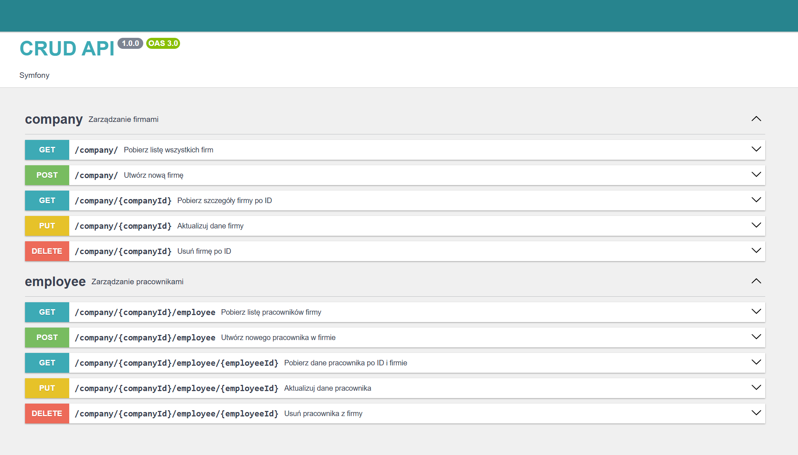

# CRUD API - Symfony

Interfejs API do zarządzania firmami oraz pracownikami.

---

## Dokumentacja API

Dostępna pod adresem: `http://localhost:8000/`



### Dostępne endpointy:

#### Zarządzanie firmami (`company`)
| Metoda | Endpoint                       | Opis                              |
|--------|-------------------------------|----------------------------------|
| GET    | `/company/`                   | Pobierz listę wszystkich firm    |
| POST   | `/company/`                   | Utwórz nową firmę                |
| GET    | `/company/{companyId}`        | Pobierz szczegóły firmy po ID    |
| PUT    | `/company/{companyId}`        | Aktualizuj dane firmy            |
| DELETE | `/company/{companyId}`        | Usuń firmę po ID                 |

#### Zarządzanie pracownikami (`employee`)
| Metoda | Endpoint                                   | Opis                                |
|--------|-------------------------------------------|------------------------------------|
| GET    | `/company/{companyId}/employee`            | Pobierz listę pracowników firmy    |
| POST   | `/company/{companyId}/employee`            | Utwórz nowego pracownika w firmie  |
| GET    | `/company/{companyId}/employee/{employeeId}` | Pobierz dane pracownika po ID i firmie |
| PUT    | `/company/{companyId}/employee/{employeeId}` | Aktualizuj dane pracownika          |
| DELETE | `/company/{companyId}/employee/{employeeId}` | Usuń pracownika z firmy             |

---

## Komendy Makefile

Wszystkie polecenia powinny być uruchamiane z poziomu katalogu projektu:

| Komenda       | Opis                                                |
|---------------|----------------------------------------------------|
| `make up`     | Uruchomienie środowiska Docker Compose w tle       |
| `make down`   | Zatrzymanie i usunięcie środowiska Docker Compose   |
| `make install`| Instalacja zależności PHP w kontenerze              |
| `make phpunit`| Uruchomienie testów PHPUnit                          |
| `make phpstan`| Analiza kodu PHPStan                                 |

### Szczegóły komend:

- `make up`  
  Uruchamia kontenery zdefiniowane w `docker-compose.yml` w tle.

- `make down`  
  Zatrzymuje i usuwa kontenery oraz sieci Docker Compose.

- `make install`  
  Wykonuje `composer install` wewnątrz kontenera aplikacji `symfony_app`.

- `make phpunit`  
  Uruchamia testy jednostkowe PHPUnit wewnątrz kontenera `symfony_app`.

- `make phpstan`  
  Uruchamia statyczną analizę kodu PHPStan wewnątrz kontenera `symfony_app`.

---

## Wymagania

- Docker i Docker Compose
- PHPStorm lub inny edytor wspierający PHP i Docker
- Composer (w środowisku kontenera)

---

Struktura :

```
src/
├── Company
│   ├── Application
│   ├── Config
│   ├── Controller
│   ├── Domain
│   └── Infrastructure
├── Employee
│   ├── Application
│   ├── Config
│   ├── Controller
│   ├── Domain
│   └── Infrastructure
├── Shared
│   ├── Application
│   ├── Config
│   ├── Domain
│   ├── Web
│   └── Infrastructure
├── ...
```

## ✉️ Autor

**Imię i nazwisko:** [Przemysław Petry]  
**E-mail:** [przemyslaw.petry@gmail.com]  
